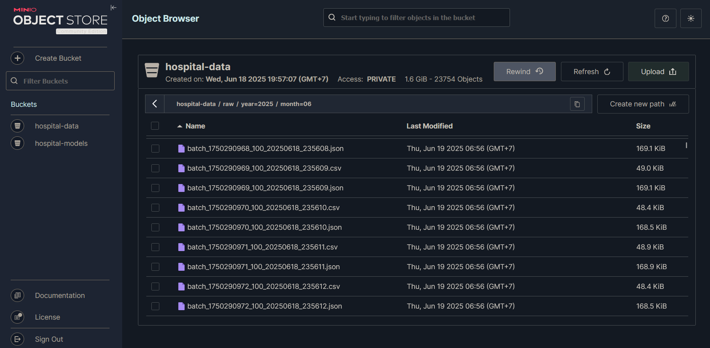

# Big Data & Data Lakehouse Final Project
# Hospital Prediction System with ML Pipeline

**Kelompok 4**

| Nama                      | NRP        | Job Description |
| ------------------------- | ---------- | --------------- |
| Nathan Kho Pancras        | 5027231002 | Apache Spark + API Developer |
| Rafael Jonathan Arnoldus  | 5027231006 | Streamlit Developer |
| Michael Kenneth Salim     | 5027231008 | UI Developer |
| Rafael Ega Krisaditya     | 5027231025 | Kafka & MinIO Developer |
| Fico Simhanandi           | 5027231030 | DuckDB Developer | 

## 🏥 Overview
This project implements a comprehensive big data system for predicting hospital outcomes including costs, length of stay, and charges using the 2015 De-identified NY Inpatient Discharge SPARCS dataset. The system features real-time data streaming, machine learning training, and an interactive web interface.

## 🏗️ Architecture


- **Apache Kafka**: Real-time data streaming and message queuing
- **Streamlit**: Real-time monitoring dashboard
- **Apache Spark**: Large-scale ML model training and data processing
- **MinIO**: S3-compatible object storage for data lakehouse
- **DuckDB**: High-performance analytical database for OLAP queries and data exploration
- **Flask API**: RESTful prediction service
- **React Frontend**: Interactive web interface

## 📋 Dataset Information
- **Source**: 2015 De-identified NY Inpatient Discharge SPARCS
- **URL**: https://www.kaggle.com/datasets/jonasalmeida/2015-deidentified-ny-inpatient-discharge-sparcs
- **Records**: 2.3M+ hospital discharge records
- **Features**: 34+ clinical and administrative features
- **Size**: ~900MB CSV file

## 🚀 Quick Start

### Prerequisites
- Docker and Docker Compose installed
- uv package manager (for Streamlit monitor)

### Setup Instructions

1. **Configure Environment**
   ```bash
   cp .env.example .env
   ```

2. **System Setup**
   ```bash
   # Linux/macOS
   ./setup.sh
   
   # Windows
   ./setup.bat
   ```

3. **Start the Complete Pipeline**
   ```bash
   # Linux/macOS - Start services in proper order
   ./manage.sh start-pipeline
   
   # Windows
   ./manage.bat start-pipeline
   
   # Or start all services at once (with building)
   ./manage.sh start
   ```

## 🔧 Management Commands

### Linux/macOS (`./manage.sh`)
```bash
./manage.sh start              # Start + build all services
./manage.sh start-pipeline     # Start services in proper order
./manage.sh stop               # Stop all services
./manage.sh status             # Show service status
./manage.sh logs               # Show all logs
./manage.sh debug              # Debug service issues
./manage.sh check-data         # Verify data availability
./manage.sh train              # Manually trigger ML training
./manage.sh test-data          # Test data loading
./manage.sh api-test           # Test prediction API
./manage.sh clean              # Clean up all data
```

### Windows (`./manage.bat`)
Same commands available for Windows with `.bat` extension.

After running either `./manage.sh start` or `./manage.sh start-pipeline`, this should appear:


## 🎯 Services & Endpoints

### 🌐 Web Interfaces
- **Frontend Dashboard**: `What you run it with.` (Main prediction interface)


Tabs:
1. 🔮 Smart Prediction: Main prediction interface requiring only DRG code
2. 🎯 Single Model: Target specific models with detailed input
3. 🤖 Manage Models: View, reload, and monitor ML models
4. 📊 System Status: Real-time system health and architecture overview

- **Kafka UI**: `http://localhost:8080` (Message queue monitoring)
  


- **MinIO Console**: `http://localhost:9090` (Object storage management)




- **Streamlit Monitor**: `http://localhost:8501` (Real-time data monitoring)


  
- **Streamlit DuckDB**: `http://localhost:8502` (Real-time data query)
  


### 🔌 API Endpoints
- **Prediction API**: `http://localhost:5001`
 


  - `GET /` - API documentation
  - `GET /health` - Health check
  - `GET /models` - List available models
  - `POST /predict/smart` - Smart prediction (minimal input)
  - `POST /predict/<model>` - Single model prediction
  - `POST /predict/all` - All models prediction

### 🗄️ Data Infrastructure
- **Kafka Broker**: `localhost:29092`
- **MinIO API**: `localhost:9000`
- **Zookeeper**: `localhost:2181`

## 🤖 Machine Learning Pipeline

### Models Trained
1. **Length of Stay Prediction**
   - Predicts hospital stay duration in days
   - Models: RandomForest, GBT

2. **Total Costs Prediction**
   - Predicts hospital treatment costs
   - Models: RandomForest, GBT

3. **Total Charges Prediction**
   - Predicts hospital billing charges
   - Models: RandomForest, GBT

### Features Used
- DRG Code (Diagnosis Related Group) - **REQUIRED**
- Severity of Illness Code - **REQUIRED**
- Age Group
- Gender
- Race and Ethnicity
- Admission Type
- Patient Disposition
- Hospital County
- Plus 10+ additional clinical features

## 🏗️ Project Structure
```
FP_BigData/
├── docker-compose.yml              # Main orchestration
├── manage.sh / manage.bat          # Management scripts
├── setup.sh / setup.bat           # Setup scripts
├── services/
│   ├── data-producer/             # Kafka producer
│   │   ├── producer.py
│   │   ├── Dockerfile
│   │   └── requirements.txt
│   ├── data-consumer/             # Kafka to MinIO consumer
│   │   ├── consumer.py
│   │   ├── monitor.py
│   │   ├── Dockerfile
│   │   └── requirements.txt
│   ├── spark-trainer/             # ML model training
│   │   ├── spark-trainer.py
│   │   ├── test_data_loading.py
│   │   ├── monitor.py
│   │   ├── Dockerfile
│   │   └── requirements.txt
│   ├── api/                       # Prediction REST API
│   │   ├── api.py
│   │   ├── test_api.py
│   │   ├── Dockerfile
│   │   └── requirements.txt
│   ├── streamlit-monitor/         # Real-time monitoring
│   │   ├── app.py
│   │   ├── pyproject.toml
│   │   ├── requirements.txt
│   │   └── uv.lock
│   ├── duckdb-query/              # DuckDB Analytics Service
│   │   ├── main.py                # FastAPI application
│   │   ├── streamlit_app.py       # Interactive interface
│   │   ├── start_services.sh      # Service startup script
│   │   ├── Dockerfile
│   │   └── requirements.txt
│   └── frontend/                  # Web interface
│       └── index.html
└── README.md
```

## 📈 Monitoring & Debugging

### System Health
```bash
./manage.sh status          # Service status and resource usage
./manage.sh debug           # Comprehensive debugging info
./manage.sh check-data      # Verify data pipeline
```

### Logs
```bash
docker-compose logs -f [service-name]
# Examples:
docker-compose logs -f spark-trainer
docker-compose logs -f api
docker-compose logs -f data-consumer
docker-compose logs -f duckdb-analytics  
```

## 🔬 Other Details

### ML Training Process
1. **Data Ingestion**: Real-time streaming via Kafka
2. **Data Storage**: Organized in MinIO with metadata
3. **Feature Engineering**: Automated preprocessing pipeline
4. **Model Training**: Multiple algorithms with cross-validation
5. **Model Evaluation**: RMSE-based performance metrics
6. **Model Deployment**: Automatic model serving via API

### 🏥 Healthcare Impact & Benefits

#### 1. **Hospital Operations Optimization**
- **Bed Management**: Predict patient flow and optimize bed allocation
- **Staffing**: Forecast resource needs based on expected patient volume and acuity
- **Discharge Planning**: Proactively plan post-acute care based on predicted LOS

#### 2. **Financial Planning & Management**
- **Budget Forecasting**: Predict revenue and costs for better financial planning
- **Insurance Pre-authorization**: Provide data-driven estimates for insurance approval
- **Cost Control**: Identify cases that may exceed expected costs for intervention

#### 3. **Patient Care Enhancement**
- **Treatment Planning**: Inform clinical decisions with data-driven insights
- **Risk Stratification**: Identify high-cost/long-stay patients for care management
- **Quality Improvement**: Monitor outcomes against predictions to improve protocols

#### 4. **Healthcare System Benefits**
- **Population Health**: Analyze trends across demographics and conditions
- **Policy Making**: Support healthcare policy decisions with predictive analytics
- **Research**: Enable retrospective and prospective clinical research